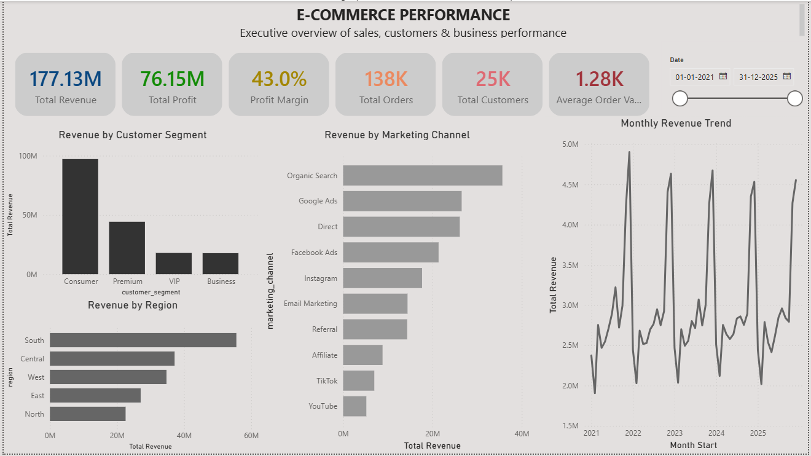
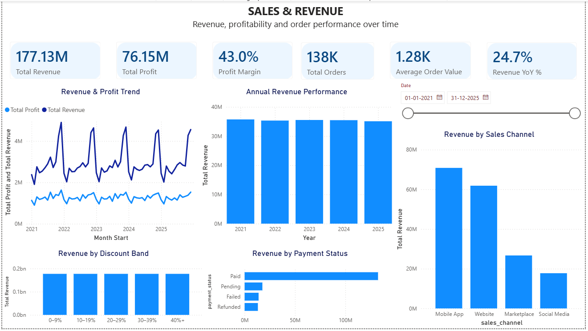
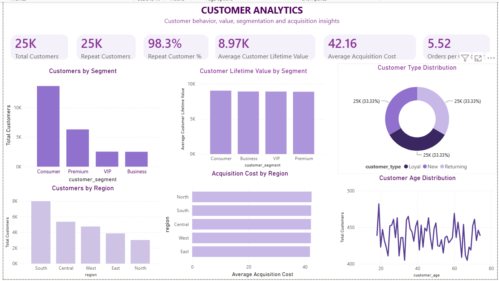
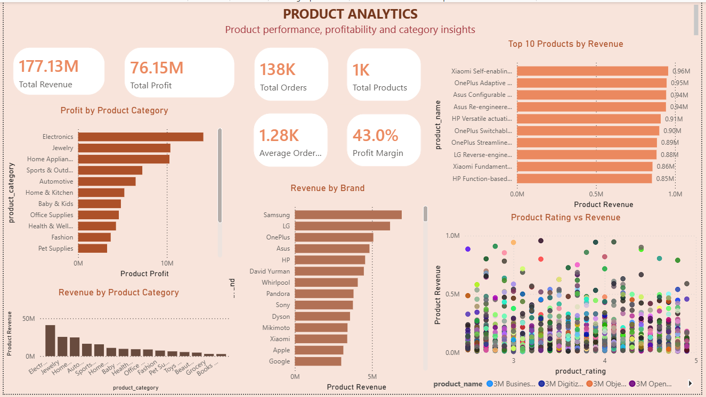
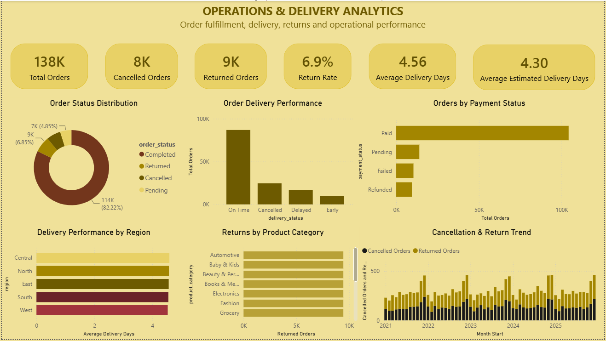

# E-Commerce Sales Analytics Dashboard

An interactive Power BI dashboard designed to analyze e-commerce sales, revenue, profitability, customer behavior, product performance, marketing channels, and operational delivery metrics.

## 📊 Dashboard Overview

The project contains multiple analytical pages covering different areas of the e-commerce business:

### 1. Executive Overview
Provides a high-level view of overall business performance.

- Total Revenue
- Total Profit
- Profit Margin
- Total Orders
- Total Customers
- Average Order Value
- Revenue by Customer Segment
- Revenue by Region
- Marketing Channel Performance
- Monthly Revenue Trend

### 2. Sales & Revenue
Focuses on revenue generation and sales performance.

- Revenue & Profit Trend
- Annual Revenue Performance
- Revenue by Sales Channel
- Revenue by Payment Status
- Revenue by Discount Band
- Revenue YoY %

### 3. Customer Analytics
Analyzes customer behavior and customer value.

- Total Customers
- Repeat Customers
- Repeat Customer %
- Average Customer Lifetime Value
- Average Acquisition Cost
- Orders per Customer
- Customers by Segment
- Customers by Region
- Customer Lifetime Value by Segment
- Customer Type Distribution

### 4. Product Analytics
Analyzes product and brand performance.

- Total Products
- Revenue by Product Category
- Profit by Product Category
- Revenue by Brand
- Top 10 Products by Revenue
- Product Rating vs Revenue
- Profit Margin

### 5. Operations & Delivery Analytics
Focuses on order fulfillment, delivery and returns.

- Total Orders
- Cancelled Orders
- Returned Orders
- Return Rate
- Average Delivery Days
- Average Estimated Delivery Days
- Order Status Distribution
- Order Delivery Performance
- Orders by Payment Status
- Delivery Performance by Region
- Returns by Product Category
- Cancellation & Return Trend

## 🛠️ Tools & Technologies

- Power BI Desktop
- DAX
- Power Query
- Data Modeling
- CSV Dataset
- Interactive Data Visualization

## 📁 Project Structure

```text
E-Commerce-Sales-Analytics/
│
├── E-Commerce Sales Analytics.pbix
├── E-Commerce Sales Analytics.pbit
├── E-Commerce Sales Analytics.Report/
├── E-Commerce Sales Analytics.SemanticModel/
│
├── ecommerce_sales_customer_analytics_150k.csv
├── customer_master.csv
├── order_items.csv
├── product_catalog.csv
├── dataset_statistics.csv
│
└── README.md
```
## 📊 Dashboard Screenshots

### Executive Overview & Sales Revenue

<p align="center">
  
  
</p>

### Customer Analytics & Product Analytics

<p align="center">
  
  
</p>

### Operations & Delivery Analytics

<p align="center">
  
</p>


